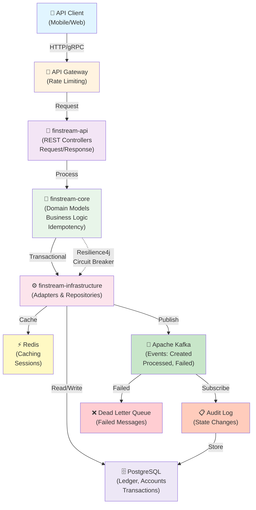

# FinStream


To build a professional-grade FinTech project like **FinStream**, you need an architecture that scales and proves your technical maturity to recruiters. This outline is your *Master Roadmap*—follow it to ensure every piece of your repository reflects enterprise standards.

---

## Architecture Overview



---

## Phase 1: Foundation & Infrastructure (The "Senior" Setup)
Before writing business logic, you must prove you can manage a production‑ready environment.

### Multi‑Module Maven Structure

```text
finstream-parent         (root POM: version management, plugin configurations)
finstream-api            (REST controllers, DTOs)
finstream-core           (domain models, business logic)
finstream-infrastructure (adapters for Kafka, PostgreSQL, Redis)
```

### Infrastructure as Code

* `docker-compose.yml`: defines Postgres, Redis, and Kafka
* `.gitignore`: exclude `.idea`, `target/`, `*.log`, and `*.env`

### CI/CD Pipeline (`.github/workflows/maven.yml`)

* Automated build & test using Maven (with Testcontainers)
* Static analysis (SonarQube) and code coverage (Codecov)
* Branch protection rules: require ≥1 review and a successful pipeline status

---

## Phase 2: Domain Modeling & Resilience
This is where the FinTech *intelligence* happens.

### Transactional Integrity
* Implement **Idempotency‑Key** logic at the API gateway/controller to prevent double charges.
* Use `@Transactional` with proper isolation levels for ledger updates.

### Resilience Patterns
* Integrate **Resilience4j** (circuit breakers) for external currency‑exchange API calls.
* Add retry mechanisms for Kafka message delivery.

### Validation
* Use `jakarta.validation` annotations (`@Positive`, `@NotNull`, etc.) at the input boundary.

---

## Phase 3: Event‑Driven Communication
FinTech systems are rarely synchronous; Kafka is your friend.

* **Event schema**: define Avro or JSON schemas for `PaymentCreated`, `PaymentProcessed`, `PaymentFailed`.
* **Dead‑letter queues (DLQ)**: handle failed message processing.
* **Audit logging**: persist every payment lifecycle state change in an audit table.

---

## Phase 4: Observability (The "Recruiter‑Pleaser")
If you can’t debug it, it isn’t enterprise.

* **Logging**: SLF4J/Logback with structured JSON for ELK compatibility
* **Metrics**: expose `/actuator/prometheus` endpoints
* **Tracing**: use micrometer‑tracing to visualize request flows

---

## Phase 5: Documentation & ADRs
Don’t just write code—explain *why*.

* **README.md** must contain:
  * Architecture diagram (Mermaid or Lucidchart)
  * `docker-compose up` instructions
  * CI/CD status badge (see above)
* **ADRs**: add a `docs/adr` folder with 2‑3 short records such as:
  * "Why PostgreSQL over NoSQL?" (ACID compliance)
  * "Why Kafka?" (eventual consistency)

---

## How to use this outline
Do not try to build everything at once. Tackle the plan in sprints:

1. **Sprint 1** – Foundation (multi‑module, Docker, CI/CD)
2. **Sprint 2** – Domain (API, database, JPA)
3. **Sprint 3** – Resilience (idempotency, circuit breakers)
4. **Sprint 4** – Events (Kafka, audit)

---

*Would you like me to generate a `finstream-parent` POM pre‑configured with enterprise dependencies (Spring Boot, Resilience4j, Testcontainers, Kafka)? That would give you a ready‑to‑code starting point.*
